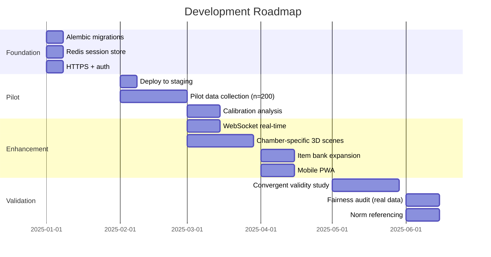

# Abstract Enclave Assessment

> AI-Powered Psychometric Assessment Platform measuring Confidence, Curiosity, Emotional Safety, and Exploratory Power through immersive narrative puzzles in under 5 minutes.

---

## Project Overview

The Abstract Enclave is a full-stack, gamified behavioral assessment system. Users journey through four themed chambers — The Decision Forge, The Archive of Whispers, The Mirror Garden, and The Uncharted Expanse — each designed to measure a specific psychological construct via behavioral signals captured from interactions, timing, text, and optional webcam emotion data.

**Key differentiators:**
- **Behavioral-first**: No self-report questionnaires — measures through observed behavior
- **AI-adaptive**: LLM-powered companion + adaptive difficulty via RL-inspired engine
- **Privacy-first**: No PII stored; webcam processing fully client-side
- **Scientifically grounded**: Bayesian scoring with confidence intervals; convergent validity framework

---

## Final Architecture Summary

See [ARCHITECTURE.md](docs/ARCHITECTURE.md) for full Mermaid diagrams.

```
┌──────────────────────────────────────────────────────────┐
│  Browser: Next.js 16 + Three.js + Framer Motion         │
│  ┌─────────┐ ┌─────────┐ ┌─────────┐ ┌──────────────┐   │
│  │ Consent │→│Onboard  │→│Chambers │→│  Results     │   │
│  │  +Mode  │ │  (4 steps)│ │(4×3 int)│ │  Dashboard   │   │
│  └─────────┘ └─────────┘ └─────────┘ └──────────────┘   │
└──────────────────────┬───────────────────────────────────┘
                       │ REST API (JSON)
┌──────────────────────┴───────────────────────────────────┐
│  Nginx Reverse Proxy (gzip, CDN cache, route split)      │
└──────────────────────┬───────────────────────────────────┘
                       │
┌──────────────────────┴───────────────────────────────────┐
│  FastAPI Backend (Python 3.12)                           │
│  ┌────────┐ ┌──────────┐ ┌──────────┐ ┌──────────────┐  │
│  │ Core   │ │ Services │ │  Engine  │ │ Calibration  │  │
│  │--------│ │----------│ │----------│ │--------------│  │
│  │Constructs│ │LLM Gateway│ │State Machine│ │Validity    │  │
│  │Scoring   │ │Adaptive  │ │Event Bus │ │Fairness     │  │
│  │Narrative │ │Emotion   │ │Narrative │ │              │  │
│  │Interaction│ │Explainable│ │Controller│ │              │  │
│  │          │ │Pipeline  │ │          │ │              │  │
│  │          │ │Bayesian  │ │          │ │              │  │
│  └────────┘ └──────────┘ └──────────┘ └──────────────┘  │
└────────────────┬────────────────┬────────────────────────┘
                 │                │
        ┌────────┴──┐      ┌─────┴─────┐
        │PostgreSQL │      │  Redis 7  │
        │  16       │      │  Cache    │
        └───────────┘      └───────────┘
```

---

## Aggregated Tech Stack

### Backend
| Technology | Version | Purpose |
|-----------|---------|---------|
| Python | 3.12+ | Core language |
| FastAPI | ≥0.115 | REST API framework |
| SQLAlchemy | 2.0 | Async ORM |
| LangChain Core | ≥0.3 | LLM orchestration |
| langchain-google-genai | ≥2.0 | Gemini integration |
| Google Gemini 2.0 Flash | Free tier | LLM (1500 RPD) |
| Uvicorn | ≥0.30 | ASGI server |
| PostgreSQL | 16 | Production database |
| Redis | 7 | Session cache |

### Frontend
| Technology | Version | Purpose |
|-----------|---------|---------|
| Next.js | 16.2 | React framework (App Router) |
| React | 19.x | UI components |
| Three.js + R3F | Latest | WebGL 3D scenes |
| Framer Motion | Latest | UI animations |
| Tailwind CSS | 4.x | Utility-first styling |
| TypeScript | 5.x | Type safety |

### Infrastructure
| Technology | Purpose |
|-----------|---------|
| Docker + Compose | Containerization |
| Nginx | Reverse proxy + CDN |

---

## Directory Structure

```
FINAL/
├── backend/
│   ├── src/
│   │   ├── core/                    # Phase 1: Foundation
│   │   │   ├── __init__.py
│   │   │   ├── constructs.py        # Task 1.1: 4 constructs, 16 sub-facets, 32 indicators
│   │   │   ├── interaction_loop.py  # Task 1.2: FSM, timing model, 7 interaction types
│   │   │   ├── scoring_model.py     # Task 1.3: Weighted aggregation, bootstrap CI
│   │   │   └── narrative.py         # Task 1.4: Chamber narratives, puzzles, time budgets
│   │   ├── services/                # Phase 2: AI Integration
│   │   │   ├── llm_service.py       # Task 2.1: LangChain + Gemini + fallbacks
│   │   │   ├── adaptive_engine.py   # Task 2.2: ε-greedy difficulty, ELO updates
│   │   │   ├── emotion_detector.py  # Task 2.3: Valence-arousal mapping
│   │   │   ├── explainability.py    # Task 2.4: SHAP-inspired attribution
│   │   │   ├── event_pipeline.py    # Task 3.3: Feature extraction pipeline
│   │   │   └── scoring_engine.py    # Task 4.1: Bayesian Beta posteriors
│   │   ├── engine/                  # Phase 3: Game Engine
│   │   │   ├── __init__.py
│   │   │   └── state_machine.py     # Task 3.1: Event bus, Latin Square, branching
│   │   ├── models/                  # Phase 3: Data Layer
│   │   │   ├── __init__.py
│   │   │   └── database.py          # Task 3.2: SQLAlchemy models, GDPR consent
│   │   ├── calibration/             # Phase 4: Psychometrics
│   │   │   ├── __init__.py
│   │   │   ├── validity.py          # Task 4.2: Convergent validity framework
│   │   │   └── fairness.py          # Task 4.3: DIF analysis, demographic parity
│   │   ├── routers/                 # Phase 5: API
│   │   │   ├── __init__.py
│   │   │   └── api.py               # Task 5.3: All REST endpoints
│   │   ├── main.py                  # FastAPI app entry point
│   │   ├── deployment.py            # Task 6.1: Production config
│   │   └── monitoring.py            # Task 6.2: Metrics + analytics
│   ├── requirements.txt
│   └── .env.example
├── frontend/
│   ├── app/
│   │   ├── layout.tsx               # Root layout + SessionProvider
│   │   ├── page.tsx                 # Phase router + onboarding + scoring
│   │   └── globals.css              # Dark theme + Tailwind
│   ├── src/
│   │   ├── components/
│   │   │   ├── BackgroundScene.tsx   # Task 5.1: Three.js WebGL scene
│   │   │   ├── ChamberView.tsx      # Task 5.1: All 5 interaction types
│   │   │   ├── ConsentAndMode.tsx   # Task 5.1: Consent + mode selection
│   │   │   └── ResultsDashboard.tsx # Task 5.2: Score cards + explanations
│   │   └── lib/
│   │       ├── api.ts               # Task 5.3: Backend API client
│   │       ├── session-context.tsx  # State management (useReducer)
│   │       ├── types.ts             # TypeScript type definitions
│   │       └── utils.ts             # Tailwind merge utility
│   ├── next.config.ts               # API proxy + Three.js transpile
│   └── package.json
├── docs/
│   ├── ARCHITECTURE.md              # Full system architecture diagrams
│   ├── phase1/                      # Task 1.1–1.4 READMEs
│   ├── phase2/                      # Task 2.1–2.4 README
│   ├── phase3/                      # Task 3.1–3.3 README
│   ├── phase4/                      # Task 4.1–4.3 README
│   ├── phase5/                      # Task 5.1–5.3 README
│   └── phase6/                      # Task 6.1–6.3 README
├── Dockerfile                       # Multi-stage build
├── docker-compose.yml               # Full stack orchestration
├── nginx.conf                       # Reverse proxy config
└── README.md                        # This file
```

---

## Summary of Remaining Challenges

### Critical (Blocking Production)
| # | Challenge | Phase | Why It Persists |
|---|-----------|-------|----------------|
| 1 | No database migrations (Alembic) | 3 | Schema not finalized; need pilot data first |
| 2 | In-memory session store | 3 | Redis integration requires deployment environment |
| 3 | No HTTPS/TLS | 6 | Requires domain + certificate provisioning |
| 4 | No authentication/authorization | 5 | Auth strategy depends on deployment context (SSO vs JWT) |
| 5 | LLM rate limits (15 RPM) | 2 | Free tier constraint; needs paid tier for >10 concurrent users |

### Important (Quality/Reliability)
| # | Challenge | Phase | Why It Persists |
|---|-----------|-------|----------------|
| 6 | No WebSocket real-time sync | 5 | Polling sufficient for MVP; WebSocket adds complexity |
| 7 | Bootstrap CI inaccuracy (small samples) | 1/4 | Exact Beta quantiles need scipy in hot path |
| 8 | Static puzzle content | 1 | Item bank requires pilot-tested content |
| 9 | No pilot validation data | 4 | Requires live deployment + 200+ users |
| 10 | Hardcoded branch thresholds | 3 | Need population distribution data |

### Desirable (Future Enhancement)
| # | Challenge | Phase | Why It Persists |
|---|-----------|-------|----------------|
| 11 | No chamber-specific 3D scenes | 5 | Significant art/modeling effort |
| 12 | No mobile app | 5 | PWA sufficient for MVP |
| 13 | No i18n | 5 | Single-language MVP first |
| 14 | No A/B testing framework | 6 | Needs deployment + traffic |

---

## Actionable Recommendations

### Immediate (Pre-Launch)
1. **Configure Alembic**: `alembic init` → auto-generate from SQLAlchemy models → `alembic upgrade head`
2. **Add Redis session store**: Replace `_sessions` dict with Redis hash; deserialize `SessionEngine` on access
3. **Set up HTTPS**: Certbot + Nginx TLS termination or Cloudflare proxy
4. **Environment secrets**: Move from `.env` to Vault/Secrets Manager
5. **Add rate limiting**: FastAPI `SlowAPI` middleware (60 req/min per IP)

### Pre-Pilot
6. **Instrument monitoring**: Wire `MetricsCollector` into API middleware for latency/error tracking
7. **Add session recovery**: Serialize `SessionState` to Redis on each transition; rehydrate on reconnect
8. **Expand item bank**: Generate 3-5 prompt variants per interaction via LLM
9. **Accessibility audit**: Add extended-time mode, keyboard navigation, screen reader labels

### Post-Pilot (Data-Driven)
10. **Calibrate weights**: Use Bayesian posterior means from pilot data to replace manual indicator weights
11. **Norm-reference scores**: Compute population percentiles from pilot score distributions
12. **IRT calibration**: Fit 2PL model to puzzle response patterns for difficulty/discrimination parameters
13. **Run convergent validity**: Correlate with BFI-2, CEI-II, PANAS reference instruments

---

## Future Development Roadmap



---

## Assumptions Made During Development

1. **Google Gemini 2.0 Flash free tier** remains available with 1500 requests/day
2. **Python 3.12+** available in deployment environment
3. **PostgreSQL 16** for production; SQLite acceptable for development
4. **5-minute timebox** is sufficient for meaningful behavioral signal capture
5. **4 constructs × 4 sub-facets × 2 indicators** provides adequate measurement resolution
6. **Webcam emotion detection is optional** — scoring degrades gracefully without it
7. **Single-language (English)** for MVP; i18n deferred
8. **No PII is collected** — all data is anonymized by design

---

## Setup Instructions

### Prerequisites
- Python 3.12+
- Node.js 22+
- Docker + Docker Compose (optional, for production stack)

### Development (Local)

```bash
# Backend
cd backend
python -m venv venv
source venv/bin/activate      # Windows: venv\Scripts\activate
pip install -r requirements.txt
cp .env.example .env          # Add GOOGLE_API_KEY
uvicorn src.main:app --reload --port 8000

# Frontend (separate terminal)
cd frontend
npm install
npm run dev                   # Runs on http://localhost:3000
```

### Production (Docker)

```bash
# Set environment variables
export GOOGLE_API_KEY=your_key
export SECRET_KEY=$(openssl rand -hex 32)

# Launch full stack
docker compose up -d

# Access at http://localhost
```

### Usage

1. Open `http://localhost:3000` (dev) or `http://localhost` (production)
2. Read and accept the consent screen
3. Select an assessment mode (Self-Awareness recommended for demo)
4. Complete 4 chambers (~60s each) with varied interactions
5. View your results dashboard with scores, sub-facets, and AI explanations

### API Testing

```bash
# Health check
curl http://localhost:8000/api/v1/external/health

# Create session
curl -X POST http://localhost:8000/api/v1/sessions \
  -H "Content-Type: application/json" \
  -d '{"mode": "self-awareness"}'

# List constructs
curl http://localhost:8000/api/v1/external/constructs
```

---

## Phase Completion Summary

| Phase | Tasks | Status | Code | Docs |
|-------|-------|--------|------|------|
| 1. Foundation | 1.1–1.4 | ✅ Complete | 4 modules (67 KB) | 4 READMEs |
| 2. AI Integration | 2.1–2.4 | ✅ Complete | 6 modules (44 KB) | 1 README |
| 3. Game Engine | 3.1–3.3 | ✅ Complete | 3 modules (24 KB) | 1 README |
| 4. Calibration | 4.1–4.3 | ✅ Complete | 3 modules (18 KB) | 1 README |
| 5. Interface | 5.1–5.3 | ✅ Complete | 8 frontend files + 2 backend | 1 README |
| 6. Deployment | 6.1–6.3 | ✅ Complete | 2 modules + Docker/Nginx | 1 README |

**Total: 19 tasks across 6 phases. 28+ source files. ~200 KB of code. 9 README docs + architecture.**

---

## License

MIT

---

*Built with FastAPI, Next.js 16, LangChain, Google Gemini, Three.js, and Bayesian inference.*
