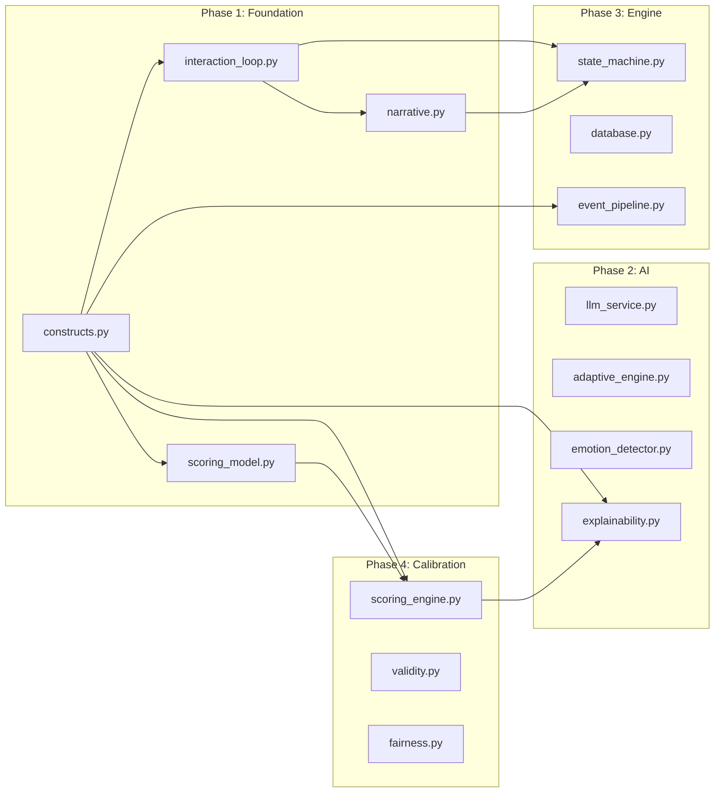

# Abstract Enclave Assessment — Full System Architecture

```mermaid
graph TB
    subgraph Client["Browser (Client)"]
        UI[Next.js 16 App<br/>React 19 + Tailwind 4]
        WEBGL[Three.js WebGL<br/>Background Scene]
        EMOTION[face-api.js<br/>Emotion Detection<br/>(client-side only)]
        STATE[SessionContext<br/>useReducer]
        
        UI --> WEBGL
        UI --> STATE
        UI -.-> EMOTION
    end
    
    subgraph Proxy["Reverse Proxy"]
        NGINX[Nginx<br/>Gzip + CDN Cache<br/>Route Split]
    end
    
    subgraph Backend["FastAPI Backend"]
        ROUTER[API Routers<br/>sessions / signals /<br/>companion / scoring]
        
        subgraph Core["Core Module"]
            CONSTRUCTS[Constructs Registry<br/>4 constructs × 4 sub-facets<br/>× 2 indicators = 32]
            INTERACTION[Interaction Loop<br/>FSM + Timing Model]
            NARRATIVE[Narrative Engine<br/>Chambers + Puzzles]
            SCORING_MODEL[Scoring Model<br/>Weighted Aggregation]
        end
        
        subgraph Services["Services"]
            LLM[LLM Gateway<br/>Gemini 2.0 Flash<br/>+ Rule Fallback]
            ADAPTIVE[Adaptive Engine<br/>ε-greedy + ELO]
            EMOTION_SVC[Emotion Aggregator<br/>Valence-Arousal]
            EXPLAIN[Explainability<br/>SHAP-inspired]
            PIPELINE[Event Pipeline<br/>Feature Extraction]
            BAYESIAN[Bayesian Scoring<br/>Beta Posteriors]
        end
        
        subgraph Engine["Game Engine"]
            SM[State Machine<br/>Event Bus + Pub/Sub]
            NARR_CTRL[Narrative Controller<br/>Branching Logic]
            LATIN[Latin Square<br/>Counterbalancing]
        end
        
        subgraph Calibration["Calibration"]
            VALIDITY[Convergent Validity<br/>BFI/CEI/PANAS/NEO]
            FAIRNESS[Fairness Audit<br/>DIF + Demographic Parity]
        end
        
        subgraph Monitoring["Monitoring"]
            METRICS[MetricsCollector<br/>Counters/Gauges/Histograms]
            ANALYTICS[AnalyticsTracker<br/>Session Lifecycle]
        end
        
        ROUTER --> Engine
        ROUTER --> Services
        Engine --> Core
        Services --> Core
    end
    
    subgraph Data["Data Layer"]
        DB[(PostgreSQL 16<br/>Sessions + Signals + Scores)]
        REDIS[(Redis 7<br/>Session Cache)]
    end
    
    subgraph External["External"]
        GEMINI[Google Gemini API<br/>Free Tier]
    end
    
    Client -->|HTTPS| NGINX
    NGINX -->|/api/*| ROUTER
    NGINX -->|/*| UI
    Backend --> DB
    Backend --> REDIS
    LLM --> GEMINI
```

## Data Flow (Single Assessment Session)


## Module Dependency Graph


