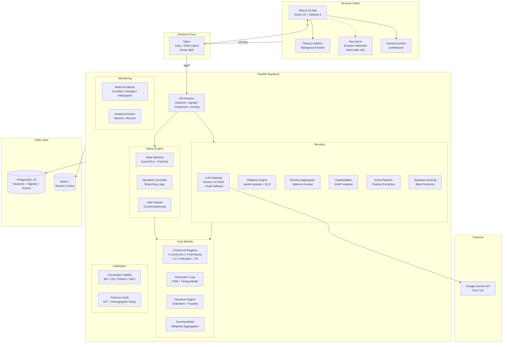
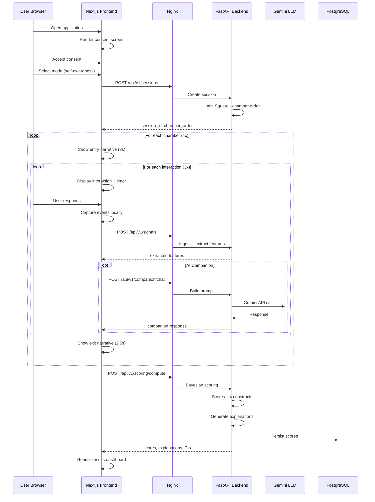

# Abstract Enclave Assessment — Full System Architecture

## System Overview



---

## Data Flow — Single Assessment Session



---

## Module Dependency Graph


---

## Technology Stack

| Layer | Technology | Version | Purpose |
|-------|-----------|---------|---------|
| **Frontend** | Next.js | 16 (App Router) | Server-side rendering, routing |
| **UI Framework** | React | 19 | Component architecture |
| **Styling** | Tailwind CSS | 4 | Utility-first CSS |
| **3D Graphics** | Three.js / R3F | Latest | Immersive background |
| **Animation** | Framer Motion | Latest | Micro-interactions |
| **Backend** | FastAPI | 0.115+ | Async REST API |
| **ORM** | SQLAlchemy | 2.0 (async) | Database abstraction |
| **Database** | PostgreSQL | 16 | Persistent storage |
| **Cache** | Redis | 7 | Session state caching |
| **AI/LLM** | Google Gemini | 2.0 Flash | Adaptive companion dialogue |
| **Proxy** | Nginx | Latest | Reverse proxy, caching |
| **Container** | Docker | Latest | Deployment orchestration |

---

## Scoring Pipeline Detail

```
Raw Signals (34 behavioral indicators)
    │
    ▼
┌──────────────────────────────┐
│  Feature Extraction          │
│  (EventPipeline)             │
│  click → latency, revision,  │
│  dwell, text, exploration    │
└──────────┬───────────────────┘
           │
           ▼
┌──────────────────────────────┐
│  Normalization               │
│  min-max → [0, 1]           │
│  polarity adjustment         │
└──────────┬───────────────────┘
           │
           ▼
┌──────────────────────────────┐
│  Weighted Aggregation        │
│  indicator → sub-facet       │
│  sub-facet → construct       │
│  (weighted average)          │
└──────────┬───────────────────┘
           │
           ▼
┌──────────────────────────────┐
│  Bayesian Posterior Update   │
│  Beta(α₀=2, β₀=2) prior     │
│  + observed evidence         │
│  → 95% credible interval    │
└──────────┬───────────────────┘
           │
           ▼
┌──────────────────────────────┐
│  Scale & Report              │
│  [0,1] → [1,10] score       │
│  + explainability layer      │
│  + strengths/growth areas    │
└──────────────────────────────┘
```

---

## Directory Structure

```
FINAL/
├── backend/
│   ├── src/
│   │   ├── core/              # Phase 1: Constructs, FSM, Scoring Model, Narrative
│   │   ├── engine/            # Phase 3: State Machine, Event Bus, Latin Square
│   │   ├── services/          # Phase 2+3: LLM, Adaptive, Emotion, Pipeline, Scoring
│   │   ├── calibration/       # Phase 4: Validity, Fairness
│   │   ├── models/            # Phase 3: SQLAlchemy DB models
│   │   ├── routers/           # Phase 5: API endpoints
│   │   ├── monitoring.py      # Phase 6: Metrics + Analytics
│   │   ├── deployment.py      # Phase 6: Config constants
│   │   └── main.py            # FastAPI app entry point
│   ├── tests/                 # 177 tests (5 test files)
│   └── requirements.txt
├── frontend/
│   ├── app/                   # Next.js App Router pages
│   └── src/
│       ├── components/        # UI components (4 main views)
│       └── lib/               # API client, session context, types
├── docs/                      # 9 READMEs + 6 test reports + architecture
├── Dockerfile                 # Multi-stage build
├── docker-compose.yml         # Full stack orchestration
├── nginx.conf                 # Reverse proxy config
└── README.md                  # Project overview
```
