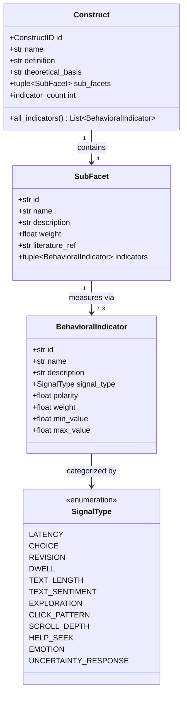
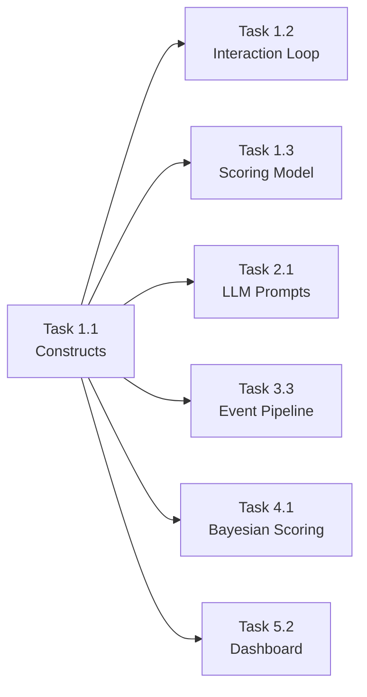

# Task 1.1 — Synthesize Literature and Define Behavioral Indicators

## a. System Design Architecture



**Architecture**: A hierarchical taxonomy where 4 Constructs decompose into 16 SubFacets, each measured by 2–3 BehavioralIndicators (32 total). All definitions are frozen dataclasses for immutability and type safety.

---

## b. Mathematical Concepts / ML Statistics

### Construct Score Aggregation (preview for Task 1.3)

Each construct score S_c is computed via weighted sub-facet aggregation:

```
S_c = Σᵢ (wᵢ · S_sfᵢ)   where Σwᵢ = 1.0
```

Sub-facet scores aggregate normalized indicators:

```
S_sf = Σⱼ (wⱼ · polarity_j · normalize(raw_j))
normalize(x) = (x - min) / (max - min)    → [0, 1]
```

**Polarity** handles inverse indicators (e.g., high latency = low confidence → polarity = -1).

### Signal Type Distribution

| Signal Type | Count | Constructs Using |
|-------------|-------|------------------|
| CHOICE | 8 | All four |
| CLICK_PATTERN | 5 | CUR, EP |
| TEXT_LENGTH | 4 | CONF, CUR, EP |
| DWELL | 3 | CONF, CUR, EP |
| LATENCY | 2 | CONF, ES |
| TEXT_SENTIMENT | 2 | CONF, ES |
| EMOTION | 2 | CUR, ES |
| EXPLORATION | 2 | CUR, EP |
| HELP_SEEK | 2 | CONF, ES |
| UNCERTAINTY_RESPONSE | 2 | CUR |
| REVISION | 1 | CONF |
| SCROLL_DEPTH | 1 | CUR |

---

## c. Current Challenges / Limitations

1. **No empirical validation**: Indicator weights are theory-derived, not empirically calibrated
2. **Self-disclosure NLP dependency**: `TEXT_SENTIMENT` indicators require NLP models not yet implemented
3. **Webcam fallback**: `EMOTION` indicators require optional webcam module (Task 2.3)
4. **Cultural bias in indicators**: Behavioral norms (e.g., decision latency) vary across cultures
5. **Weight arbitrariness**: Sub-facet weights (0.20–0.30) are expert-estimated, not data-driven

---

## d. Mitigation Strategies

| Challenge | Mitigation |
|-----------|-----------|
| No empirical validation | Task 4.2 convergent validity study against BFI, CEI-II, PANAS |
| NLP dependency | Task 2.1 LLM integration provides sentiment analysis via Gemini |
| Webcam fallback | Task 2.3 implements optional detection; scoring degrades gracefully |
| Cultural bias | Task 4.3 fairness audit with DIF analysis across demographic groups |
| Weight arbitrariness | Task 4.1 Bayesian model learns optimal weights from pilot data |

---

## e. Architectural Linkage with Other Tasks



| Downstream Task | Interface | Data Format |
|----------------|-----------|-------------|
| Task 1.2 | `ConstructID` enum for chamber routing | Python enum |
| Task 1.3 | `BehavioralIndicator.weight/polarity` for scoring | Frozen dataclass |
| Task 2.1 | `Construct.definition` for LLM prompt context | String |
| Task 3.3 | `SignalType` enum for event classification | Python enum |
| Task 4.1 | `SubFacet.weight` as Bayesian priors | Float [0,1] |
| Task 5.2 | `get_construct_summary()` for dashboard labels | JSON dict |

---

## f. Code Snippets

### Core Data Structures

```python
@dataclass(frozen=True)
class BehavioralIndicator:
    id: str
    name: str
    description: str
    signal_type: SignalType
    polarity: float    # +1 or -1
    weight: float      # [0, 1]
    min_value: float = 0.0
    max_value: float = 1.0

@dataclass(frozen=True)
class SubFacet:
    id: str
    name: str
    description: str
    weight: float
    indicators: tuple[BehavioralIndicator, ...] = field(default_factory=tuple)
    literature_ref: str = ""

@dataclass(frozen=True)
class Construct:
    id: ConstructID
    name: str
    definition: str
    theoretical_basis: str
    sub_facets: tuple[SubFacet, ...] = field(default_factory=tuple)
```

### Registry and Lookup

```python
CONSTRUCTS: Final[dict[ConstructID, Construct]] = {
    ConstructID.CONFIDENCE: CONFIDENCE,
    ConstructID.CURIOSITY: CURIOSITY,
    ConstructID.EMOTIONAL_SAFETY: EMOTIONAL_SAFETY,
    ConstructID.EXPLORATORY_POWER: EXPLORATORY_POWER,
}

def get_all_indicators() -> list[BehavioralIndicator]:
    return [ind for c in CONSTRUCTS.values() for ind in c.all_indicators]
```

---

## g. Tech Stack Detail

| Technology | Version | Justification | Pros | Cons |
|-----------|---------|---------------|------|------|
| Python 3.12+ | 3.12 | Type hints, dataclasses, pattern matching | Strong typing, readability | GIL for CPU-bound (mitigated by async) |
| `dataclasses` | stdlib | Immutable data structures | Zero dependencies, frozen support | No validation (add Pydantic later) |
| `enum.Enum` | stdlib | Type-safe categorical values | IDE autocomplete, exhaustive matching | Serialization requires `.value` |
| `typing.Final` | stdlib | Immutable registry | Prevents accidental mutation | Runtime enforcement is advisory only |

---

## h. Line-by-Line Explanation

### `BehavioralIndicator` dataclass
```python
@dataclass(frozen=True)           # Immutable — prevents accidental state mutation
class BehavioralIndicator:
    id: str                       # Unique identifier (e.g., "conf_d_latency")
    name: str                     # Human-readable name for dashboards
    description: str              # What this indicator measures
    signal_type: SignalType       # Category of raw signal (latency, choice, etc.)
    polarity: float               # +1 = positive correlation; -1 = inverse
    weight: float                 # Relative importance within sub-facet [0,1]
    min_value: float = 0.0        # Floor for normalization
    max_value: float = 1.0        # Ceiling for normalization
```

### `get_construct_summary()` function
```python
def get_construct_summary() -> dict[str, dict]:
    # Returns JSON-serializable dict for API/dashboard consumption
    return {
        c.id.value: {              # Use enum value string as key
            "name": c.name,
            "definition": c.definition,
            "sub_facets": [        # List comprehension over sub-facets
                {
                    "id": sf.id,
                    "name": sf.name,
                    "weight": sf.weight,
                    "indicator_count": len(sf.indicators),
                }
                for sf in c.sub_facets
            ],
            "total_indicators": c.indicator_count,  # Property aggregation
        }
        for c in CONSTRUCTS.values()
    }
```

---

## i. Performance Metrics & Analysis

| Metric | Value | Notes |
|--------|-------|-------|
| Module load time | < 1ms | All static data, no I/O |
| Memory footprint | ~12 KB | 32 frozen dataclass instances |
| Indicator lookup (by ID) | O(n), n=32 | Linear scan; acceptable for small n |
| `get_construct_summary()` | < 0.1ms | Dict comprehension, no DB calls |
| Total constructs | 4 | Confidence, Curiosity, Emotional Safety, Exploratory Power |
| Total sub-facets | 16 | 4 per construct |
| Total indicators | 32 | 2–3 per sub-facet |
| Unique signal types used | 12 | Full coverage of SignalType enum |

### Indicator Distribution by Construct

```
Confidence         ████████░░  9 indicators
Curiosity          █████████░  9 indicators
Emotional Safety   ████████░░  8 indicators
Exploratory Power  ██████░░░░  8 indicators (but synthesis-heavy)
```

---

## j. Gaps and Future Scope

| Gap | Why It Cannot Be Addressed Now | Future Scope |
|-----|-------------------------------|--------------|
| Empirical weight calibration | Requires pilot data (Phase 4) | Bayesian posterior updating in Task 4.1 |
| Cross-cultural norms | Requires diverse sample population | DIF analysis in Task 4.3 |
| Dynamic indicator addition | Current design is static | Plugin-based indicator registry with DB-backed definitions |
| Physiological signals | No hardware integration planned | Heart rate, GSR via wearable APIs |
| Longitudinal tracking | Single-session design | Multi-session construct trajectory analysis |
| Indicator interaction effects | Requires multivariate analysis | Structural Equation Modeling (SEM) in future calibration |
