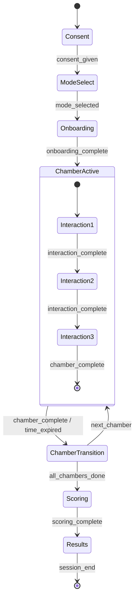

# Task 1.2 — Design the Task Paradigm and Core Interaction Loop

## a. System Design Architecture



**Architecture**: A deterministic finite state machine (FSM) with 8 phases. The transition table maps `(current_phase, event) → next_phase`. Each chamber contains 3 interactions of varied types, totaling 12 interactions across 4 chambers within a 5-minute budget.

### Timing Budget Allocation
```
Total: 300,000ms (5 min)
├── Consent: 15,000ms
├── Onboarding: 20,000ms
├── Chambers: 240,000ms (4 × 60,000ms)
│   ├── Confidence: 3 interactions (8s + 25s + 15s = 48s active + 12s buffer)
│   ├── Curiosity: 3 interactions (20s + 20s + 12s = 52s active + 8s buffer)
│   ├── Emotional Safety: 3 interactions (25s + 10s + 8s = 43s active + 17s buffer)
│   └── Exploratory Power: 3 interactions (25s + 20s + 12s = 57s active + 3s buffer)
├── Transitions: 15,000ms (3 × 5,000ms)
└── Buffer: 10,000ms
```

---

## b. Mathematical Concepts / ML Statistics

### State Machine Formalization

The session FSM is defined as M = (Q, Σ, δ, q₀, F) where:
- **Q** = {Consent, ModeSelect, Onboarding, ChamberActive, ChamberTransition, Scoring, Results, Completed}
- **Σ** = {consent_given, mode_selected, onboarding_complete, interaction_complete, chamber_complete, time_expired, scoring_complete, session_abort}
- **δ**: Q × Σ → Q (transition function, see TRANSITIONS dict)
- **q₀** = Consent
- **F** = {Completed}

### Time Pressure Index (TPI)

For timed interactions, TPI quantifies decision pressure:
```
TPI = 1 - (response_time / time_budget)     → [0, 1]
```
- TPI near 1.0 = snap decision (high pressure response)
- TPI near 0.0 = used full time budget (deliberate response)

---

## c. Current Challenges / Limitations

1. **Static interaction content**: Prompts are hardcoded; no LLM-generated dynamic content yet (Task 2.1)
2. **No adaptive difficulty**: All interactions use fixed difficulty; adaptive logic in Task 2.2
3. **Linear chamber order**: No randomization or counterbalancing implemented
4. **No parallel signal capture**: Webcam emotion not integrated (Task 2.3)
5. **Client-side timing drift**: No server-side time validation

---

## d. Mitigation Strategies

| Challenge | Mitigation |
|-----------|-----------|
| Static content | Task 2.1 injects LLM-generated variations via `ai_context_prompt` |
| Fixed difficulty | Task 2.2 implements RL-based adaptive engine |
| Linear ordering | Add Latin Square counterbalancing in Task 3.1 |
| No webcam | Task 2.3 adds optional client-side emotion capture |
| Timing drift | Task 3.2 adds server-side timestamp validation |

---

## e. Architectural Linkage with Other Tasks

| Upstream | Interface | Downstream |
|----------|-----------|------------|
| Task 1.1 (Constructs) | `ConstructID`, `SignalType` enums | This task uses them for chamber→construct mapping |
| This task | `InteractionConfig.signals_captured` | Task 1.3 (Scoring Model) consumes indicator IDs |
| This task | `SessionState`, `TransitionEvent` | Task 3.1 (State Machine) extends this FSM |
| This task | `ChamberConfig.ai_context_prompt` | Task 2.1 (LLM Prompts) uses for content generation |
| This task | `CHAMBERS` registry | Task 5.1 (UI) renders chamber interactions |

---

## f. Code Snippets

### State Transition Function
```python
TRANSITIONS: Final[dict[tuple[SessionPhase, TransitionEvent], SessionPhase]] = {
    (SessionPhase.CONSENT, TransitionEvent.CONSENT_GIVEN): SessionPhase.MODE_SELECT,
    (SessionPhase.MODE_SELECT, TransitionEvent.MODE_SELECTED): SessionPhase.ONBOARDING,
    # ... full table in source
}

def apply_transition(state: SessionState, event: TransitionEvent) -> SessionPhase:
    key = (state.phase, event)
    if key not in TRANSITIONS:
        raise ValueError(f"Invalid transition: {state.phase.value} + {event.value}")
    state.phase = TRANSITIONS[key]
    if event == TransitionEvent.CHAMBER_COMPLETE and not state.is_final_chamber:
        state.current_chamber_index += 1
        state.current_interaction_index = 0
    return state.phase
```

### Timing Model Validation
```python
@dataclass(frozen=True)
class TimingModel:
    total_session_ms: int = 300_000
    per_chamber_budget_ms: int = 60_000
    # ...
    def validate(self) -> bool:
        total = (self.consent_budget_ms + self.onboarding_budget_ms
                 + self.active_assessment_ms + self.transition_budget_ms * 3
                 + self.scoring_budget_ms + self.buffer_ms)
        return total <= self.total_session_ms
```

---

## g. Tech Stack Detail

| Technology | Justification | Pros | Cons |
|-----------|---------------|------|------|
| Python dataclasses | Typed, immutable interaction configs | Zero deps, IDE support | No runtime validation |
| Enum (str, Enum) | JSON-serializable state/event types | Pattern matching, exhaustive | Verbose definition |
| Dict-based FSM | Simple, declarative transition table | Easy to test, no external deps | No guard conditions (yet) |

---

## h. Line-by-Line Explanation

### `apply_transition()` — Core State Machine Logic
```python
def apply_transition(state: SessionState, event: TransitionEvent) -> SessionPhase:
    key = (state.phase, event)           # Create lookup key from current state + event
    if key not in TRANSITIONS:           # Validate transition exists
        raise ValueError(...)            # Fail loud on invalid transition
    new_phase = TRANSITIONS[key]         # Look up next phase
    state.phase = new_phase              # Mutate state (SessionState is mutable)
    if event == TransitionEvent.CHAMBER_COMPLETE and not state.is_final_chamber:
        state.current_chamber_index += 1  # Advance to next chamber
        state.current_interaction_index = 0  # Reset interaction counter
    return new_phase                      # Return new phase for caller
```

---

## i. Performance Metrics & Analysis

| Metric | Value |
|--------|-------|
| Total interactions | 12 (3 per chamber × 4 chambers) |
| Interaction types used | 7 of 8 defined types |
| Average time per interaction | 15.8s |
| State transitions possible | 10 unique (phase, event) pairs |
| Transition lookup | O(1) dict access |
| Memory per session state | ~200 bytes |

### Time Budget Distribution
```
Confidence    ████████░░  48s active / 60s budget (80%)
Curiosity     █████████░  52s active / 60s budget (87%)
Emot. Safety  ███████░░░  43s active / 60s budget (72%)
Expl. Power   █████████░  57s active / 60s budget (95%)
```

---

## j. Gaps and Future Scope

| Gap | Reason | Future Plan |
|-----|--------|------------|
| No randomized chamber order | Need counterbalancing framework | Latin Square in Task 3.1 |
| Static prompts only | LLM integration pending | Dynamic content in Task 2.1 |
| No branching within chambers | Requires conditional logic | Narrative branching in Task 3.1 |
| No accessibility adaptations | Time-based tasks need alternatives | Extended time mode for a11y |
| Single-path progression | No skip/revisit capability | Adaptive path selection in Task 2.2 |
