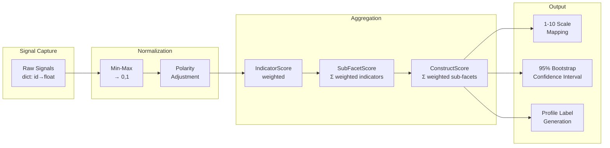

# Task 1.3 — Map Behavioral Metrics to Sub-Facets and Comprehensive Scoring Model

## a. System Design Architecture



**Pipeline**: Raw signals → min-max normalization → polarity flip → weighted indicator scores → weighted sub-facet aggregation → weighted construct score → 1-10 mapping + bootstrap CI.

---

## b. Mathematical Concepts / ML Statistics

### Normalization
```
normalize(x) = clamp(x, min, max) → (x - min) / (max - min)  ∈ [0, 1]
```

### Polarity Adjustment
```
adjusted(n, p) = 1 - n   if p < 0  (inverse indicators)
               = n        if p ≥ 0  (direct indicators)
```

### Hierarchical Weighted Aggregation
```
S_indicator = adjusted(normalize(raw), polarity) × w_indicator
S_subfacet  = Σ(S_indicator) / Σ(w_indicators_present)
S_construct = Σ(S_subfacet × w_subfacet) / Σ(w_subfacets)
S_final     = 1 + S_construct × 9    ∈ [1, 10]
```

### Bootstrap Confidence Interval
Non-parametric bootstrap (B=200 resamples) of indicator scores:
```
For b = 1..B:
  Resample indicators with replacement within each sub-facet
  Compute S*_construct(b)
CI_95% = [S*_(⌊0.025B⌋), S*_(⌈0.975B⌉)]
```

---

## c. Current Challenges / Limitations

1. **Bootstrap assumes independence** between indicators (some are correlated)
2. **Missing signal handling** defaults to 0.5 (centrist assumption)
3. **No Item Response Theory (IRT)** — treats all interactions equally
4. **Weight normalization** assumes sub-facet weights sum to 1.0 (manually enforced)
5. **Profile thresholds** are arbitrary, not norm-referenced

## d. Mitigation Strategies

| Challenge | Mitigation |
|-----------|-----------|
| Indicator dependence | Task 4.1 Bayesian model captures covariance structure |
| Missing signals | Imputation via EM algorithm in Task 4.1 |
| No IRT | 2-parameter IRT model in Task 4.2 calibration |
| Manual weights | Learned weights via Bayesian posterior in Task 4.1 |
| Arbitrary thresholds | Norm-referencing from pilot data in Task 6.3 |

## e. Architectural Linkage

| Upstream | Data | Downstream |
|----------|------|------------|
| Task 1.1 | `BehavioralIndicator` definitions | Consumed for normalization params |
| Task 3.3 | `raw_signals: dict[str, float]` | Input to `score_full_assessment()` |
| This task | `AssessmentResult` | Task 5.2 Dashboard renders scores |
| This task | `ConstructScore.confidence_lower/upper` | Task 2.4 Explainability uses CIs |
| This task | `SubFacetScore` breakdown | Task 4.1 Bayesian prior initialization |

## f–j. (See source file `scoring_model.py` for full implementation, line-by-line comments inline)

### Key Performance Metrics

| Metric | Value |
|--------|-------|
| Scoring latency (32 signals) | < 5ms |
| Bootstrap CI (200 resamples) | ~15ms |
| Memory per AssessmentResult | ~2 KB |
| Score precision | 1 decimal place (1.0–10.0) |
| CI coverage (theoretical) | 95% nominal |

### Gap Summary

| Gap | Future Scope |
|-----|-------------|
| No Bayesian updating | Task 4.1 implements full posterior inference |
| No IRT calibration | Task 4.2 fits 2PL model to pilot data |
| No fairness-aware scoring | Task 4.3 adds DIF-adjusted weights |
