# Task 1.4 — Outline Narrative and Puzzle Components within 5-Minute Timebox

## a. System Design Architecture

```mermaid
graph TB
    subgraph Session["5-Minute Session Flow"]
        PRO[Prologue<br/>14s] --> C1[Chamber 1: Decision Forge<br/>60s]
        C1 --> T1[Transition<br/>5s]
        T1 --> C2[Chamber 2: Archive of Whispers<br/>60s]
        C2 --> T2[Transition<br/>5s]
        T2 --> C3[Chamber 3: Mirror Garden<br/>60s]
        C3 --> T3[Transition<br/>5s]
        T3 --> C4[Chamber 4: Uncharted Expanse<br/>60s]
        C4 --> EPI[Epilogue<br/>6.5s]
    end
    
    subgraph ChamberStructure["Chamber Internal"]
        EB[Entry Beats<br/>~5s] --> I1[Interaction 1]
        I1 --> IT1[Transition Beat<br/>~2s]
        IT1 --> I2[Interaction 2]
        I2 --> IT2[Transition Beat<br/>~2s]
        IT2 --> I3[Interaction 3]
        I3 --> XB[Exit Beat<br/>~2.5s]
    end
```



### Time Budget Summary Table

| Component | Duration | Cumulative |
|-----------|----------|------------|
| Prologue | 14.0s | 14.0s |
| Chamber 1 (Confidence) | 60.0s | 74.0s |
| Transition 1 | 5.0s | 79.0s |
| Chamber 2 (Curiosity) | 60.0s | 139.0s |
| Transition 2 | 5.0s | 144.0s |
| Chamber 3 (Emotional Safety) | 60.0s | 204.0s |
| Transition 3 | 5.0s | 209.0s |
| Chamber 4 (Exploratory Power) | 60.0s | 269.0s |
| Epilogue | 6.5s | 275.5s |
| Scoring Animation | 10.0s | 285.5s |
| **Buffer** | **14.5s** | **300.0s** |

---

## b. Mathematical Concepts / ML Statistics

### Puzzle Difficulty Calibration
Difficulty d ∈ [0, 1] maps to expected completion rate via logistic function:
```
P(correct | d) = 1 / (1 + e^(4(d - 0.5)))
```
At d=0.5, P(correct) ≈ 50%. This follows IRT's 1PL Rasch model.

### Scoring Rubric Weighting
Each puzzle has a rubric mapping outcomes to scores [0, 1]. These feed into the behavioral indicator system from Task 1.1/1.3.

---

## c. Current Challenges / Limitations

1. **Static narrative**: No dynamic text generation from LLM yet
2. **Fixed puzzle content**: Same puzzles for all users (no item bank)
3. **No pilot-tested timing**: Time budgets are estimated, not validated
4. **Limited puzzle variety**: Only pattern and spatial types implemented
5. **No accessibility**: Timed elements may exclude users with disabilities

## d. Mitigation Strategies

| Challenge | Mitigation |
|-----------|-----------|
| Static narrative | Task 2.1 LLM generates variations |
| Fixed puzzles | Task 2.2 adaptive engine selects from item bank |
| Untested timing | Task 6.3 pilot data calibrates budgets |
| Limited variety | Future: add logic, wordplay, memory puzzle types |
| Accessibility | Add extended-time mode; non-timed alternatives |

## e. Architectural Linkage

- **Upstream**: Task 1.2 `ChamberConfig` defines interaction slots that narrative fills
- **Downstream**: Task 3.1 state machine uses `NarrativeBeat` for transition timing
- **Downstream**: Task 5.1 UI renders `NarrativeBeat.text` with animations
- **Downstream**: Task 2.1 LLM uses puzzle descriptions as generation prompts

## f–j. Key Metrics

| Metric | Value |
|--------|-------|
| Total narrative beats | 20 |
| Total puzzles | 3 (Confidence, Curiosity, Exploratory Power) |
| Average narrative per chamber | 11.5s |
| Time budget utilization | 92.2% (275.5s / 300s) |
| Puzzle types | 2 (pattern, spatial) |
