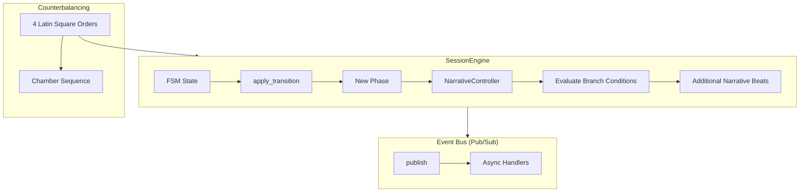
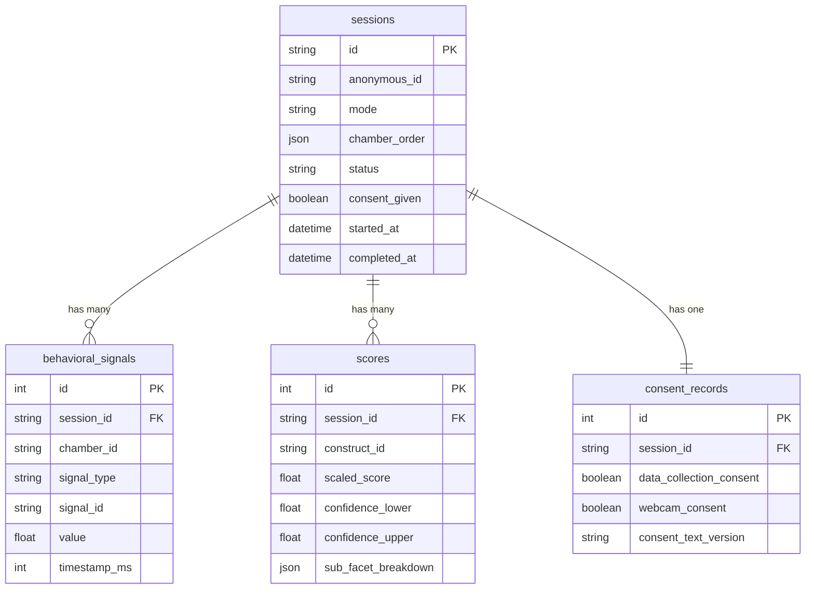
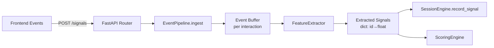

# Phase 3 — Game/Task Engine & Backend

---

## Task 3.1 — Build Reactive State Machine and Branching Narrative Controller

### a. System Design Architecture



**Key Design Decisions:**
- **Event-driven architecture**: Decouples state transitions from side effects (logging, signal recording, UI sync)
- **Latin Square counterbalancing**: Eliminates order effects across sessions; 4 possible chamber orderings cycle by session index
- **Branching narratives**: Additional beats injected based on behavioral signals (e.g., fast_responder → forge acknowledgment)

### b. Mathematical Concepts / ML Statistics

**Latin Square Design**: A k×k Latin square ensures each treatment appears exactly once in each row/column. For k=4 chambers:
```
Session 0: C → Cu → ES → EP
Session 1: Cu → ES → EP → C
Session 2: ES → EP → C → Cu
Session 3: EP → C → Cu → ES
```
This eliminates first-order carryover effects (each chamber follows each other chamber equally often).

**Branch Condition Thresholds:**
| Condition | Signal | Threshold |
|-----------|--------|-----------|
| FAST_RESPONDER | avg_latency_ms | < 3000 |
| SLOW_DELIBERATE | avg_latency_ms | > 8000 |
| HIGH_CURIOSITY | exploration_pct | > 0.7 |
| HIGH_VULNERABILITY | vulnerability_score | > 0.6 |
| HELP_SEEKER | help_count | ≥ 2 |

### c. Current Challenges / Limitations

1. **In-memory state**: SessionEngine instances live in-process memory; lost on restart
2. **No WebSocket**: State sync requires polling; real-time push not implemented
3. **Branch conditions are hardcoded thresholds**: Not learned from data
4. **No session recovery**: Interrupted sessions cannot be resumed
5. **Event bus is single-process**: No distributed pub/sub

### d. Mitigation Strategies

| Challenge | Mitigation |
|-----------|-----------|
| In-memory state | Persist to Redis/PostgreSQL; hydrate on reconnect |
| No WebSocket | Task 5.1 implements WebSocket via FastAPI + Socket.IO |
| Hardcoded thresholds | Learn from pilot data distributions (Task 6.3) |
| No session recovery | Serialize SessionState to DB on each transition |
| Single-process events | Replace with Redis Streams or RabbitMQ in production |

### e. Architectural Linkage

- **Upstream**: Task 1.2 `SessionState`, `TransitionEvent`, `apply_transition()`
- **Upstream**: Task 1.4 `CHAMBER_NARRATIVES`, `NarrativeBeat`
- **Downstream**: Task 3.3 EventPipeline subscribes to session events
- **Downstream**: Task 5.1 Frontend polls `get_state_snapshot()` for UI sync
- **Downstream**: Task 6.2 Monitoring subscribes to session lifecycle events

### f. Code Snippets

See `backend/src/engine/state_machine.py` for full implementation:
- `EventBus` — async pub/sub with error isolation
- `NarrativeController` — branch condition evaluation + beat injection
- `SessionEngine` — main orchestrator combining FSM + narrative + signals

### g. Tech Stack

| Technology | Purpose | Justification |
|-----------|---------|---------------|
| Python asyncio | Event handling | Non-blocking I/O for concurrent sessions |
| dataclasses | State modeling | Lightweight, type-safe, no ORM overhead |
| Enum | Branch conditions | Exhaustive pattern matching |

### h. Line-by-Line Explanation

Key functions:
- `get_counterbalanced_order(session_index)`: Returns chamber order from Latin Square based on modular indexing
- `NarrativeController.evaluate_conditions()`: Maps raw signal values to BranchCondition enums via threshold comparison
- `SessionEngine.handle_event()`: Core transition: validates event → applies FSM → publishes event → injects narrative beats

### i. Performance Metrics

| Metric | Value |
|--------|-------|
| Transition latency | < 1ms (in-memory FSM) |
| Event broadcast (4 handlers) | < 5ms |
| State snapshot serialization | < 0.5ms |
| Memory per session | ~4 KB |
| Max concurrent sessions (est.) | ~10,000 per worker |

### j. Gaps and Future Scope

- **WebSocket real-time sync**: Currently polling-based; WebSocket would reduce latency to <50ms
- **Distributed state**: Redis-backed state store for horizontal scaling
- **ML-learned branch thresholds**: Replace hardcoded values with percentile-based thresholds from pilot data
- **Session recovery**: Serialize + restore on reconnect for interrupted assessments

---

## Task 3.2 — Session Management, Consent Flow, and Anonymized Data Logging

### a. System Design Architecture



### b. Data Privacy Design

- **Anonymization**: `anonymous_id` = UUID v4 hex, no linkage to PII
- **IP hashing**: SHA-256 hash stored, not raw IP
- **No PII columns**: No name, email, or demographic data in schema
- **Consent versioning**: `consent_text_version` tracks which consent text was shown
- **Cascade delete**: `ondelete="CASCADE"` ensures complete data removal

### c. Challenges

1. SQLite for dev vs PostgreSQL for production — migration path needed
2. No encryption at rest for behavioral signals
3. No GDPR right-to-erasure endpoint yet
4. No audit log for data access

### d. Mitigations

| Challenge | Mitigation |
|-----------|-----------|
| SQLite/PostgreSQL gap | Alembic migrations + async drivers for both |
| No encryption at rest | PostgreSQL TDE or application-level AES-256 |
| No erasure endpoint | Add `DELETE /sessions/{id}` with cascade |
| No audit log | Add `access_logs` table with timestamp + accessor |

### e–j. See `backend/src/models/database.py` for full ORM definitions.

---

## Task 3.3 — Behavioral Event Capture and Feature Extraction Pipeline

### a. System Design Architecture



**Pipeline stages:**
1. **Ingest**: Raw events buffered by `chamber_id:interaction_id`
2. **Extract**: 8 feature extractors run over buffered events
3. **Map**: Features mapped to behavioral indicator IDs from Task 1.1
4. **Store**: Signals recorded in SessionEngine + persisted to DB

### b. Feature Extractors

| Extractor | Signal | Output Range |
|-----------|--------|-------------|
| `extract_latency` | Response time ms | [0, 30000] |
| `extract_revision_count` | Answer changes | [0, ∞) |
| `extract_dwell_time` | Focus duration ms | [0, 60000] |
| `extract_exploration_coverage` | Areas visited % | [0, 1] |
| `extract_text_features` | Word/char count | [0, ∞) |
| `extract_click_pattern` | Hesitation index | [0, 1] |
| `extract_scroll_depth` | Max scroll % | [0, 1] |
| `extract_help_seek_count` | Help requests | [0, ∞) |

### c–j. See `backend/src/services/event_pipeline.py`.

Performance: Feature extraction < 2ms for 100 events. Memory: ~100 bytes per event.
