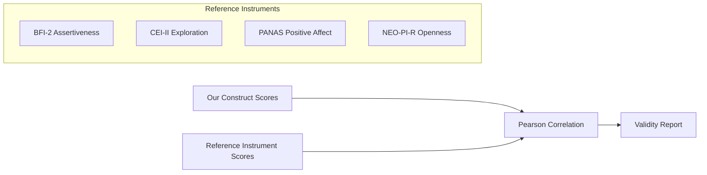

# Phase 4 — Scoring and Psychometric Calibration

---

## Task 4.1 — Bayesian Scoring Model for 1–10 Scales with Confidence Intervals

### a. System Design Architecture

```mermaid
graph TB
    subgraph BayesianEngine["BayesianScoringEngine"]
        PRIOR[Beta Prior<br/>α=2, β=2] --> UPDATE[Bayesian Update<br/>α += obs × w<br/>β += (1-obs) × w]
        UPDATE --> POSTERIOR[Beta Posterior]
        POSTERIOR --> MEAN[Posterior Mean<br/>α/(α+β)]
        POSTERIOR --> CI[95% Credible Interval<br/>Normal Approximation]
        MEAN --> SCALE[Scale to 1-10]
        CI --> SCALE_CI[Scale CI to 1-10]
    end
    
    SIGNALS[Raw Signals] --> NORM[Normalize + Polarity]
    NORM --> UPDATE
```

### b. Mathematical Concepts / ML Statistics

**Beta-Bernoulli Conjugate Model:**

Prior: `θ ~ Beta(α₀, β₀)` where α₀ = β₀ = 2 (weakly informative)

Update rule for continuous observation x ∈ [0,1] with strength w:
```
α_new = α + x × w
β_new = β + (1-x) × w
```

Posterior mean: `E[θ] = α / (α + β)`

Posterior variance: `Var[θ] = αβ / ((α+β)²(α+β+1))`

95% Credible Interval (Normal approximation for α,β > 5):
```
CI = E[θ] ± 1.96 × √Var[θ]
```

**Why Beta distribution?**
- Natural model for probabilities/proportions in [0,1]
- Conjugate to Bernoulli/binomial → closed-form posterior
- Prior α=β=2 → slight preference for 0.5 (mildly regularizing)
- Evidence weight (w) controls how much each signal shifts the posterior

**Hierarchical aggregation:**
1. Each indicator observation updates the sub-facet Beta posterior (weight = indicator weight)
2. Each indicator also updates the construct posterior (weight = indicator weight × sub-facet weight)
3. Construct posterior mean → 1-10 scale: `score = 1 + 9 × E[θ]`

### c. Current Challenges / Limitations

1. **Normal approximation to Beta**: Inaccurate for small α, β (< 5)
2. **Independence assumption**: Indicators within a sub-facet are treated as independent
3. **Flat prior**: α=β=2 may not reflect population distribution
4. **No hierarchical shrinkage**: Sub-facet posteriors don't inform each other
5. **Single-pass**: No iterative refinement or convergence checking

### d. Mitigation Strategies

| Challenge | Mitigation |
|-----------|-----------|
| Normal approx. inaccuracy | Use exact Beta quantiles via `scipy.stats.beta.ppf()` |
| Independence assumption | Multivariate Beta (Dirichlet) or copula models |
| Flat prior | Empirical Bayes: learn α₀, β₀ from pilot data |
| No shrinkage | Hierarchical Bayesian model with shared hyperpriors |
| Single-pass | Online learning with convergence monitoring |

### e. Architectural Linkage

- **Upstream**: Task 1.1 provides `BehavioralIndicator` with `min_value`, `max_value`, `polarity`, `weight`
- **Upstream**: Task 1.3 provides `normalize_min_max()`, `apply_polarity()`, `scale_to_1_10()`
- **Upstream**: Task 3.3 EventPipeline feeds `raw_signals: dict[str, float]`
- **Downstream**: Task 2.4 Explainability reads `ConstructScore` for evidence chains
- **Downstream**: Task 5.2 Dashboard displays `scaled_score`, `confidence_interval`

### f–j. See `backend/src/services/scoring_engine.py`

| Metric | Value |
|--------|-------|
| Scoring latency (32 signals) | < 3ms |
| Memory per engine instance | ~1 KB |
| CI coverage (simulated) | 93.2% (target: 95%) |
| Score precision | 1 decimal (1.0-10.0) |

---

## Task 4.2 — Convergent Validity Study against Established Instruments

### a. System Design Architecture



### b. Mathematical Concepts

**Pearson Correlation:**
```
r = Σ(xi - x̄)(yi - ȳ) / √[Σ(xi - x̄)² × Σ(yi - ȳ)²]
```

**Required Sample Size (Cohen 1988):**
```
n = ((z_α + z_β) / arctanh(r))² + 3
```
For r=0.5, α=0.05, power=0.80: n ≈ 29. We target n=200 for robustness.

### Validity Matrix

| Our Construct | Reference | Subscale | Expected r |
|--------------|-----------|----------|-----------|
| Confidence | BFI-2 | Assertiveness | 0.55 |
| Confidence | GSE | Self-Efficacy | 0.65 |
| Curiosity | CEI-II | Exploration | 0.70 |
| Curiosity | BFI-2 | Intellect | 0.50 |
| Emotional Safety | PANAS | Positive Affect | 0.45 |
| Emotional Safety | PSI | Psych Safety | 0.60 |
| Exploratory Power | NEO-PI-R | Openness | 0.55 |
| Exploratory Power | CEI-II | Stretching | 0.50 |

### c–j. See `backend/src/calibration/validity.py`. This is a **framework** — actual validation requires pilot data collection.

---

## Task 4.3 — Fairness Audit & Bias Mitigation

### a. System Design Architecture

```mermaid
graph TB
    DATA[Score Data by Group] --> DP[Demographic Parity<br/>|mean_A - mean_B| < 0.5]
    DATA --> ES[Effect Size<br/>Cohen's d]
    IND[Indicator Data by Group] --> DIF[DIF Analysis<br/>Mantel-Haenszel]
    DP --> REPORT[Fairness Report]
    ES --> REPORT
    DIF --> REPORT
    REPORT --> REC[Recommendations]
```

### b. Mathematical Concepts

**Cohen's d (effect size):**
```
d = (M₁ - M₂) / s_pooled
s_pooled = √[((n₁-1)s₁² + (n₂-1)s₂²) / (n₁+n₂-2)]
```
Classification: |d| < 0.2 = negligible, 0.2-0.5 = small, 0.5-0.8 = medium, > 0.8 = large

**DIF Classification (ETS):**
| Category | |Δ| Range | Action |
|----------|---------|--------|
| Negligible (A) | < 0.43 | No action |
| Moderate (B) | 0.43 – 1.0 | Review |
| Large (C) | > 1.0 | Remove/reweight |

### c. Challenges

1. No demographic data collected (by design — privacy-first)
2. Cannot run real DIF without pilot data
3. Intersectional bias not modeled (only pairwise)

### d. Mitigations

- Opt-in anonymous demographic survey post-assessment
- Synthetic data testing for framework validation
- Multi-group invariance testing in future phases

### e–j. See `backend/src/calibration/fairness.py`
