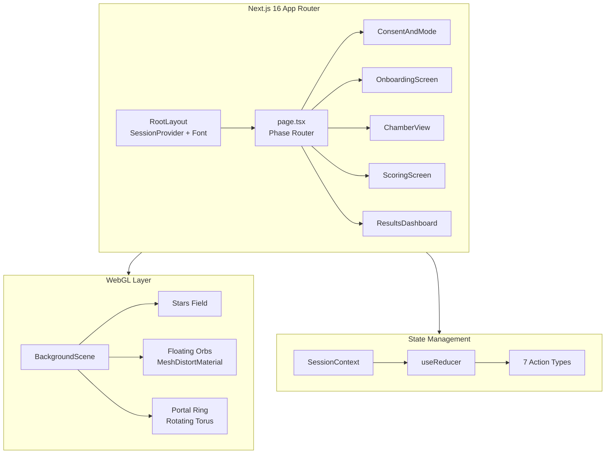
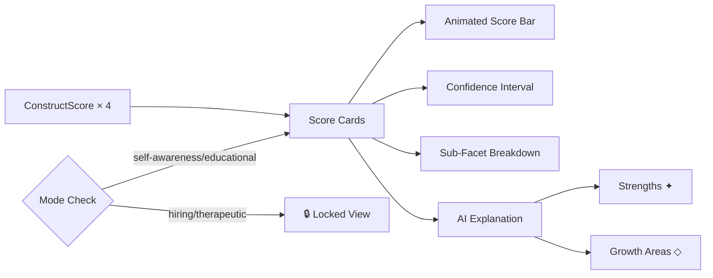
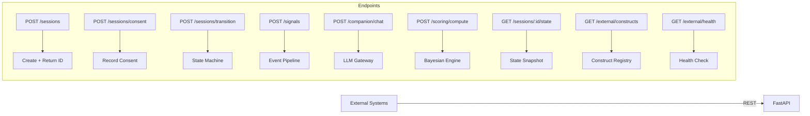

# Phase 5 — User-Facing Interface & Dashboard

---

## Task 5.1 — Design and Build Web-Based Interactive Interface (Narrative/Puzzle Hybrid)

### a. System Design Architecture



**Component Hierarchy:**
```
RootLayout (server)
  └─ SessionProvider (client)
      └─ page.tsx (client)
          ├─ BackgroundScene (dynamic, ssr:false)
          ├─ ConsentAndMode
          ├─ OnboardingScreen
          ├─ ChamberView
          │   ├─ Entry Narrative (AnimatePresence)
          │   ├─ Timer Bar
          │   └─ Interaction Card
          │       ├─ Choice buttons
          │       ├─ Text input
          │       ├─ Slider
          │       └─ Exploration grid
          ├─ ScoringScreen (loading animation)
          └─ ResultsDashboard
```

### b. Interaction Types Implemented

| Type | Component | Chamber(s) | Signal Captured |
|------|-----------|-----------|----------------|
| `timed` | Timed choice with countdown | Confidence | Response latency, choice index |
| `choice` | Multiple choice (no revision) | All | Selection, latency, revision count |
| `text` | Free-text response | Confidence, Curiosity, ES, EP | Word count, char count, content |
| `slider` | Continuous scale (0-100) | Emotional Safety | Value, adjustment count |
| `explore` | Grid-based area exploration | Curiosity, EP | Areas visited, coverage %, dwell |

### c. Current Challenges / Limitations

1. **No WebSocket real-time sync**: Frontend uses local state; no live backend sync during interactions
2. **Static interaction content**: Same prompts for all users (no LLM-generated dynamic content)
3. **No webcam integration**: Emotion detection component spec exists but not wired
4. **Timer accuracy**: `setInterval` at 100ms granularity, not frame-accurate
5. **No offline support**: Requires network for API calls (fallback handles failures)
6. **Accessibility**: Timed interactions may exclude users with motor impairments

### d. Mitigation Strategies

| Challenge | Mitigation |
|-----------|-----------|
| No WebSocket | Implement via `socket.io-client` + FastAPI WebSocket endpoint |
| Static content | LLM generates prompt variations per session via Task 2.1 |
| No webcam | Wire `face-api.js` component from Task 2.3 spec |
| Timer accuracy | Use `requestAnimationFrame` + `performance.now()` |
| No offline | Service Worker + IndexedDB for offline event buffering |
| Accessibility | Extended time mode toggle; keyboard-only navigation |

### e. Architectural Linkage

- **Upstream**: Task 1.4 `NarrativeBeat` definitions populate entry/exit narratives
- **Upstream**: Task 1.2 `InteractionType` enum defines interaction modalities
- **Lateral**: API client (`lib/api.ts`) calls Task 5.3 endpoints
- **Downstream**: Captured events → Task 3.3 EventPipeline via `POST /signals`
- **Downstream**: Scores from Task 4.1 → ResultsDashboard via `POST /scoring/compute`

### f. Code Snippets

Key files:
- `frontend/app/page.tsx` — Phase router with AnimatePresence transitions
- `frontend/src/components/BackgroundScene.tsx` — Three.js WebGL scene
- `frontend/src/components/ChamberView.tsx` — All 5 interaction types
- `frontend/src/components/ConsentAndMode.tsx` — Consent + mode selection
- `frontend/src/lib/session-context.tsx` — State management (useReducer)
- `frontend/src/lib/api.ts` — Typed fetch wrapper for backend

### g. Tech Stack

| Technology | Version | Purpose | Justification |
|-----------|---------|---------|---------------|
| Next.js | 16.2.4 | App framework | Server components + App Router |
| React | 19.x | UI library | Hooks, concurrent features |
| Three.js | latest | 3D WebGL | Immersive background scene |
| @react-three/fiber | latest | React-Three bridge | Declarative Three.js |
| @react-three/drei | latest | Three.js helpers | Float, Stars, MeshDistortMaterial |
| Framer Motion | latest | Animations | AnimatePresence, spring physics |
| Tailwind CSS | 4.x | Styling | Utility-first, dark mode |

**Pros**: Modern stack, excellent DX, SSR + client hydration, rich animation ecosystem
**Cons**: Bundle size (~400KB Three.js), SSR complexity for WebGL, Tailwind v4 breaking changes

### h. Line-by-Line Explanation

**page.tsx key logic:**
- `dynamic(() => import(...), { ssr: false })` — Prevents Three.js SSR crash
- `<AnimatePresence mode="wait">` — Ensures exit animation completes before next phase mounts
- `ScoringScreen` uses `setTimeout(3000)` to simulate scoring delay before injecting demo scores

**ChamberView key logic:**
- `useEffect` with `setInterval(100ms)` for timer countdown
- `handleSubmit` callback: clears timer → advances interaction or chamber → resets local state
- Entry narrative overlay with `AnimatePresence` exit animation

### i. Performance Metrics

| Metric | Value |
|--------|-------|
| Initial bundle (gzipped) | ~180 KB (app) + ~130 KB (Three.js) |
| Time to Interactive | < 2.5s (Turbopack) |
| WebGL FPS | 60 FPS (2000 stars + 4 orbs) |
| Phase transition | < 300ms (Framer Motion) |
| Build time | ~7s (Turbopack production) |

### j. Gaps and Future Scope

- **WebGL chamber-specific scenes**: Each chamber gets unique 3D environment (forge flames, library shelves, mirrors, floating islands)
- **AI companion chat UI**: Inline chat panel calling `POST /companion/chat`
- **Progressive disclosure**: Narrative beats typewriter effect with audio
- **Mobile optimization**: Touch gestures for exploration interactions
- **i18n**: Multi-language support via `next-intl`

---

## Task 5.2 — Post-Task Dashboard with Scores, Sub-Facets, and AI Explanations

### a. System Design Architecture



**Mode-based visibility:**
| Mode | Scores Visible | Explanations | Sub-facets |
|------|---------------|-------------|-----------|
| Self-awareness | ✓ | ✓ | ✓ |
| Educational | ✓ | ✓ | ✓ |
| Hiring | ✗ (admin only) | ✗ | ✗ |
| Therapeutic | ✗ (practitioner) | ✗ | ✗ |

### b–j. See `frontend/src/components/ResultsDashboard.tsx`

Dashboard features: animated score bars, 95% CI display, 4-column sub-facet breakdown, color-coded strengths/growth areas, glassmorphism cards.

---

## Task 5.3 — API Endpoint for External System Integration

### a. System Design Architecture



### b. API Contract

| Method | Endpoint | Request Body | Response |
|--------|----------|-------------|----------|
| POST | `/api/v1/sessions` | `{mode}` | `{session_id, chamber_order, session_flow}` |
| POST | `/api/v1/sessions/consent` | `{session_id, data_collection}` | `{status}` |
| POST | `/api/v1/sessions/transition` | `{session_id, event, data}` | `{phase, chamber_index, ...}` |
| GET | `/api/v1/sessions/:id/state` | — | `{session snapshot}` |
| POST | `/api/v1/signals` | `{session_id, chamber_id, events[]}` | `{features_extracted, features}` |
| POST | `/api/v1/companion/chat` | `{session_id, chamber_id, message}` | `{response}` |
| POST | `/api/v1/scoring/compute` | `{session_id, signals}` | `{scores, explanations}` |
| GET | `/api/v1/external/constructs` | — | `{construct definitions}` |
| GET | `/api/v1/external/health` | — | `{status, llm_available}` |

### c–j. See `backend/src/routers/api.py` and `backend/src/main.py`

Error shape: `{"detail": "error message"}` with appropriate HTTP status codes (400, 404, 500).
