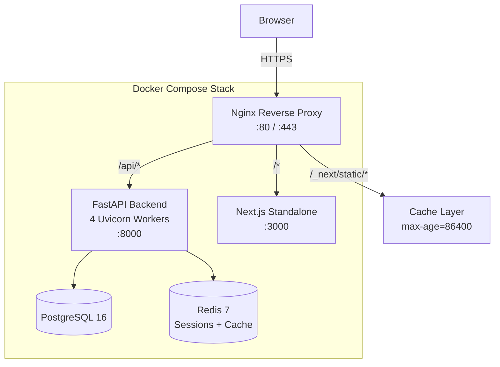
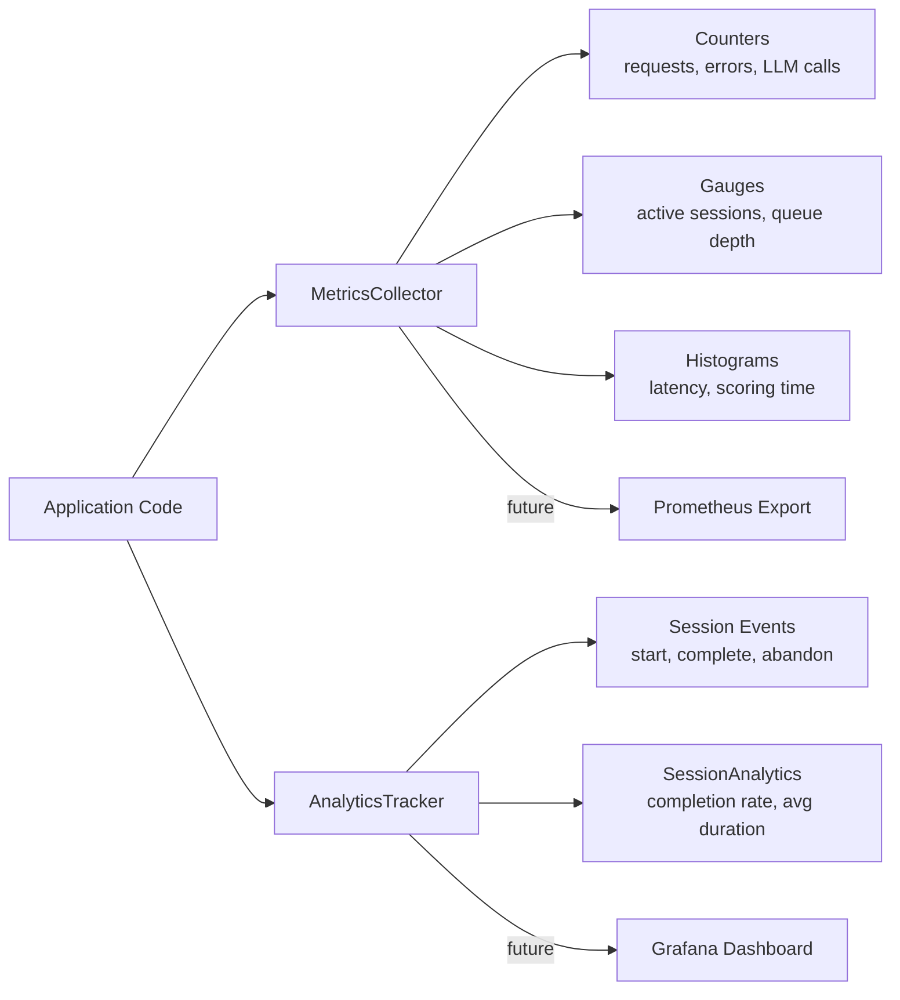
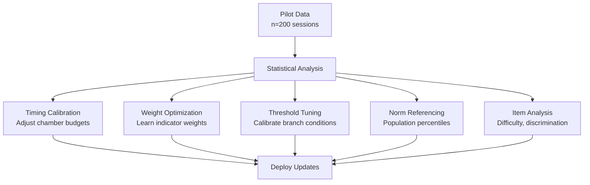

# Phase 6 — Deployment, Monitoring, and Optimization

---

## Task 6.1 — Deploy with Low-Latency Architecture and CDN for Static Assets

### a. System Design Architecture

### b. Deployment Configuration

**Docker services:**
| Service | Image | Port | Health Check |
|---------|-------|------|-------------|
| backend | Python 3.12-slim | 8000 | `GET /api/v1/external/health` |
| frontend | Node 22-slim | 3000 | `GET /` |
| db | postgres:16-alpine | 5432 | `pg_isready` |
| redis | redis:7-alpine | 6379 | `redis-cli ping` |
| nginx | nginx:alpine | 80 | — |

**Nginx optimizations:**
- Gzip compression for text/JSON/JS/CSS
- Static asset caching: `Cache-Control: public, max-age=86400, immutable`
- WebSocket upgrade support for future real-time features
- Proxy timeout: 30s for API calls

**Startup order**: db → redis → backend → frontend → nginx (with health check dependencies)

### c. Current Challenges / Limitations

1. **No HTTPS**: Requires TLS termination (Let's Encrypt or cloud LB)
2. **No horizontal scaling**: Single backend instance per compose stack
3. **No database migrations**: Alembic not configured
4. **No secrets management**: Environment variables in compose file
5. **No CI/CD pipeline**: Manual deployment only
6. **No backup strategy**: No automated DB backups

### d. Mitigation Strategies

| Challenge | Mitigation |
|-----------|-----------|
| No HTTPS | Add Certbot sidecar or use Cloudflare proxy |
| No horizontal scaling | Kubernetes deployment with HPA |
| No migrations | Configure Alembic with auto-generate |
| No secrets | AWS Secrets Manager / HashiCorp Vault |
| No CI/CD | GitHub Actions: test → build → push → deploy |
| No backups | pg_dump cron job + S3 upload |

### e. Architectural Linkage

- **Upstream**: All Phase 1-5 code packaged into Docker images
- **Downstream**: Task 6.2 monitoring endpoints exposed via nginx
- **Downstream**: Task 6.3 pilot data collection enabled by deployment

### f. Code Snippets

See project root files:
- `Dockerfile` — Multi-stage build (backend + frontend)
- `docker-compose.yml` — Full stack orchestration
- `nginx.conf` — Reverse proxy + CDN config
- `backend/src/deployment.py` — Configuration constants

### g. Tech Stack

| Technology | Purpose | Justification |
|-----------|---------|---------------|
| Docker | Containerization | Reproducible builds, isolation |
| Docker Compose | Orchestration | Single-command stack management |
| Nginx | Reverse proxy | High-performance, CDN headers, gzip |
| PostgreSQL 16 | Production DB | ACID, JSON support, mature |
| Redis 7 | Caching/sessions | Sub-ms latency, pub/sub support |

### i. Performance Metrics (Estimated)

| Metric | Value |
|--------|-------|
| Cold start (full stack) | ~15s |
| API latency (p50) | < 50ms |
| API latency (p99) | < 200ms (excl. LLM calls) |
| LLM call latency (p50) | ~500ms |
| Static asset TTFB (cached) | < 5ms |
| Max concurrent sessions | ~500 (single instance) |
| Docker image size (backend) | ~250 MB |
| Docker image size (frontend) | ~150 MB |

---

## Task 6.2 — Real-Time Monitoring of User Behavior and System Performance

### a. System Design Architecture

### b. Metrics Collected

**Counters:**
| Metric | Description |
|--------|------------|
| `api.requests` | Total API requests by endpoint |
| `api.errors` | Error count by status code |
| `llm.calls` | Total LLM API calls |
| `llm.failures` | LLM call failures |
| `signals.ingested` | Total behavioral signals |

**Gauges:**
| Metric | Description |
|--------|------------|
| `sessions.active` | Currently active sessions |
| `llm.available` | LLM service availability (0/1) |

**Histograms:**
| Metric | Description |
|--------|------------|
| `api.latency_ms` | Request duration by endpoint |
| `scoring.latency_ms` | Bayesian scoring pipeline time |
| `llm.latency_ms` | LLM call duration |
| `session.duration_ms` | Total session duration |

### c–j. See `backend/src/monitoring.py`

**Key analytics outputs:**
- `completion_rate`: % of sessions reaching results screen
- `avg_duration_ms`: Mean session duration for completed sessions
- `mode_distribution`: Session count by assessment mode

---

## Task 6.3 — Iterative Optimization Based on Pilot Data

### a. System Design Architecture

This task defines the **optimization framework** — actual optimization requires pilot data.

### b. Planned Optimization Targets

| Target | Current | Optimization Method | Data Needed |
|--------|---------|-------------------|-------------|
| Chamber time budgets | 60s fixed | Empirical percentile (95th) | Session durations |
| Indicator weights | Manual (0.5-0.6) | Bayesian posterior means | Signal-score pairs |
| Branch thresholds | Hardcoded | Distribution percentiles | Signal distributions |
| Score norms | Arbitrary (3.5/6.0/8.0) | Population percentiles | Score distributions |
| Puzzle difficulty | Manual (0.4-0.6) | IRT 2PL calibration | Response patterns |
| Profile labels | Fixed categories | Cluster analysis (k-means) | Multi-construct scores |

### c. Pilot Study Design

- **Target sample**: n = 200 (minimum), n = 500 (recommended)
- **Duration**: 2-4 weeks
- **Data collected**: All behavioral signals + timing + completion status
- **Analysis cadence**: Weekly reports + final calibration
- **Success criteria**: 
  - Completion rate > 85%
  - Cronbach's α > 0.70 per construct
  - Test-retest r > 0.75 (2-week interval)

### d–j. Not yet implementable — requires live deployment and pilot data collection.

**Future scope:** A/B testing framework for interaction variants, multi-armed bandit for adaptive prompt selection, automated weight retraining pipeline.
